# 🌟 NetBox & cEOS VXLAN Fabric Cookbook 🌟

## 📚 Introduction

This cookbook guides you through setting up a VXLAN fabric using NetBox for configuration management and cEOS for network virtualization. Perfect for demonstrating NetBox's capabilities with RenderConfig to generate a complete fabric configuration.

## 🛠️ Prepare Data

### 📋 Populate NetBox

1. Generate a NetBox token via the web UI
2. Execute the Python script to import your device models:

```bash
uv run import.py http://localhost:8080 YOUR_TOKEN Devices/devices_model.yml
```

## 🏗️ Create Fabric

Run the fabric creation script:

```bash
uv run Create_Fabric/main.py
NetBox URL: http://localhost:8080                   
NetBox API Token: 
Number of buildings (1-5): 4
Spine device type slug: ceos
Leaf device type slug: ceos
Access switch device type slug: ceos

Existing Sites:
  1. Paris (slug=paris)
Choose site number or 'new': 1
```

### 🔍 View Topology

Using the Topology View plugin:

1. Navigate to Topology View > Topology
2. Click on 'filter' and enable:
   - ✅ Show Circuit Terminations
   - ✅ Show Cables
   - ✅ Group Sites
   - ✅ Group Locations
   - ✅ Node Label Item: Device Name

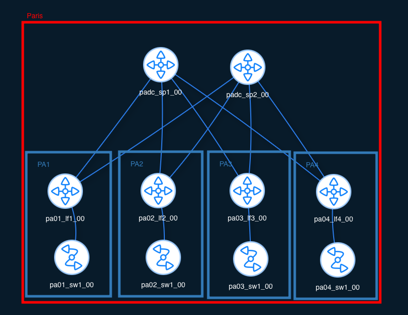

## 👥 Add Customer

```bash
❯ uv run Create_Fabric/add_customers.py
Enter NetBox URL: http://localhost:8080
Enter NetBox API Token: 4e58e40e6b19d7f6cc53ae5665ca7ddd00558e71
Enter Customer Name: Orange
Enter VLAN ID (1-4094): 10
Enter VNI ID: 10010

Available Locations:
0: PA1
1: PA2
2: PA3
3: PA4
Select locations (comma-separated indices): 0,2

❯ uv run Create_Fabric/add_customers.py
Enter NetBox URL: http://localhost:8080
Enter NetBox API Token: 4e58e40e6b19d7f6cc53ae5665ca7ddd00558e71
Enter Customer Name: Purple
Enter VLAN ID (1-4094): 10
Enter VNI ID: 10010

Available Locations:
0: PA1
1: PA2
2: PA3
3: PA4
Select locations (comma-separated indices): 1,3
```

## 📝 Apply Templates

### 📤 Import Templates to NetBox

1. Go to Operation > Data Sources > +Add
2. Configure:
   - Name: Templates
   - Type: Local
   - URL: /tmp/templates
3. Click on Sync

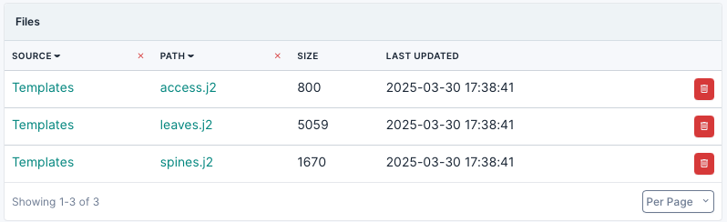

### 📋 Create Config Templates

Create 3 templates in Provisioning > Config Templates:

1. Name: Spine
   - Data Source: Templates
   - File: spine.j2
2. Name: Leaf
   - Data Source: Templates
   - File: leaf.j2
3. Name: Access
   - Data Source: Templates
   - File: access.j2


When complete, you should see:

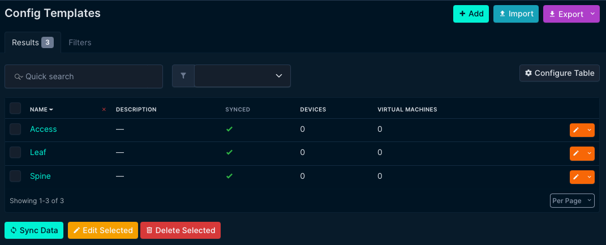

### 🔄 Reconfigure Devices

1. Go to Devices > Devices
2. Filter by role:
   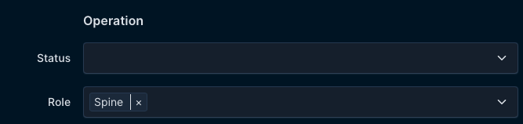
3. Select all and Edit Selected:
   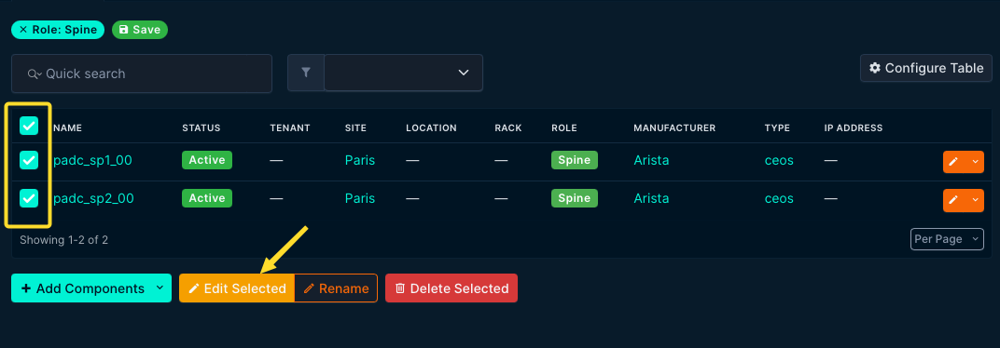
4. In the configuration part, select the matching Config Template for the device role:
   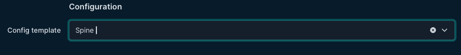
5. Repeat for all three roles: Spine, Leaf, and Access

Now you can view configurations via Render Config:
Devices > Devices > Render Config

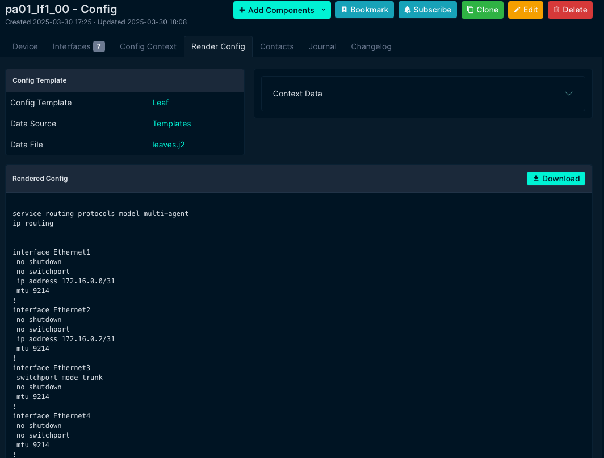

## 🚀 Deploy NetLab

Deploy a containerlab environment to validate your configuration:

```bash
cd containerlab
❯ clab deploy -t fabric_vxlan.yml
```

You should see output showing all your devices running:

```bash
╭───────────────────────────────┬───────────────┬─────────┬────────────────╮
│              Name             │   Kind/Image  │  State  │ IPv4/6 Address │
├───────────────────────────────┼───────────────┼─────────┼────────────────┤
│ clab-vxlan_fabric-host1       │ linux         │ running │ 172.20.20.21   │
│                               │ alpine:latest │         │ N/A            │
...
│ clab-vxlan_fabric-padc_sp2_00 │ ceos          │ running │ 172.20.20.11   │
│                               │ ceos:4.33.2F  │         │ N/A            │
╰───────────────────────────────┴───────────────┴─────────┴────────────────╯
```

### 📊 View Lab Topology

Using the VSCode Containerlab extension:

1. Open Containerlab panel
2. Right-click and select "Graph Lab (TopoViewer)"

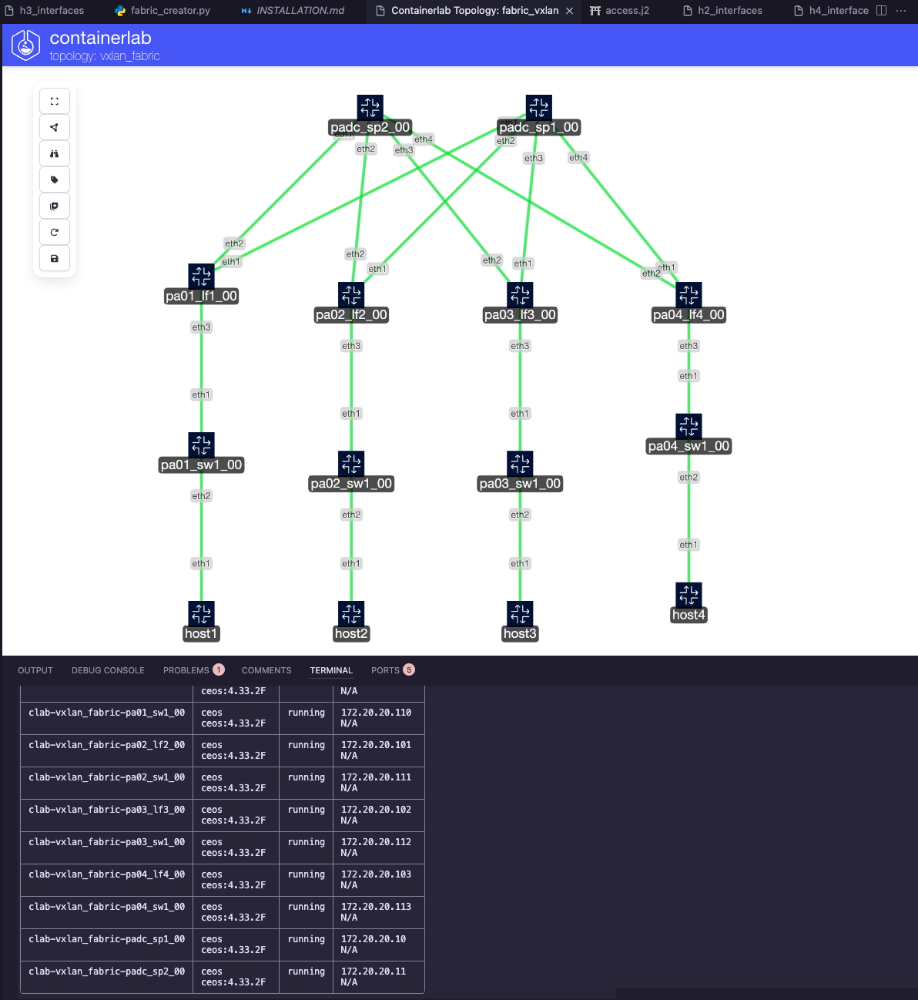

## ⚙️ Deploy Configuration

Currently, you need to manually apply configurations:

1. Use the VSCode extension to "Connect to SSH" for each device  
   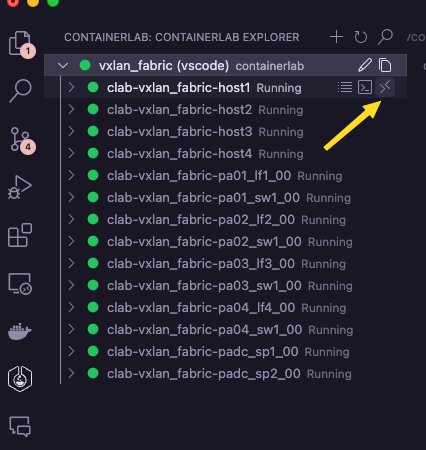

2. Login credentials:
   - **Username:** admin
   - **Password:** admin
   - Remember to enter "**en**" for enable mode and "**conf t**" for configuration mode

3. Copy/paste the rendered configuration from NetBox

### 🔍 Validate Configuration

Check BGP, EVPN, and VXLAN configuration:

```bash
pa01_lf1_00(config)#show bgp summary
BGP summary information for VRF default
Router identifier 192.168.100.2, local AS number 65101
Neighbor               AS Session State AFI/SAFI                AFI/SAFI State   NLRI Rcd   NLRI Acc
------------- ----------- ------------- ----------------------- -------------- ---------- ----------
172.16.0.1          65001 Established   IPv4 Unicast            Negotiated              3          3
...

pa01_lf1_00(config)#show bgp evpn
BGP routing table information for VRF default
...
```

### 🔌 Enable Host Interfaces

Connect to each host and enable eth1:

```bash
ifup eth1
```

Check VXLAN address table on leaf devices:

```bash
pa01_lf1_00#show vxlan address-table
          Vxlan Mac Address Table
----------------------------------------------------------------------
VLAN  Mac Address     Type      Prt  VTEP             Moves   Last Move
----  -----------     ----      ---  ----             -----   ---------
  10  aac1.ab60.2c6b  EVPN      Vx1  192.168.100.4    1       0:04:23 ago
Total Remote Mac Addresses for this criterion: 1
```

## ✅ Validate Connectivity

Two customers should be configured:

1. 🟠 **Orange**
   - Subnet: 10.0.0.0/24
   - Hosts:
     - PA1: 10.0.0.10
     - PA3: 10.0.0.20

2. 🟣 **Purple**
   - Subnet: 10.0.1.0/24
   - Hosts:
     - PA2: 10.0.1.10
     - PA4: 10.0.1.20

Test connectivity with ping:

```bash
/ # ifconfig eth1
eth1      Link encap:Ethernet  HWaddr AA:C1:AB:49:55:B6  
          inet addr:10.0.0.10  Bcast:0.0.0.0  Mask:255.255.255.0
...

/ # ping 10.0.0.20
PING 10.0.0.20 (10.0.0.20): 56 data bytes
64 bytes from 10.0.0.20: seq=0 ttl=64 time=15.378 ms
64 bytes from 10.0.0.20: seq=1 ttl=64 time=4.349 ms
...
```

## 🔍 Packet Capture

Edgeshark is available for packet analysis:

```bash
❯ cd /opt/edgeshark 
❯ docker compose up -d
```

Using the VSCode extension, start Wireshark by clicking on **Capture Interface**:

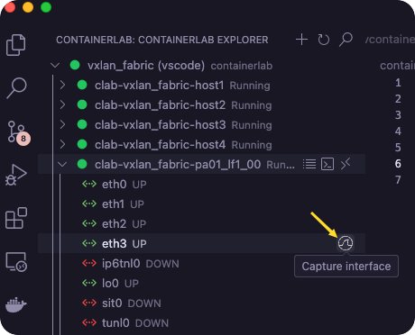

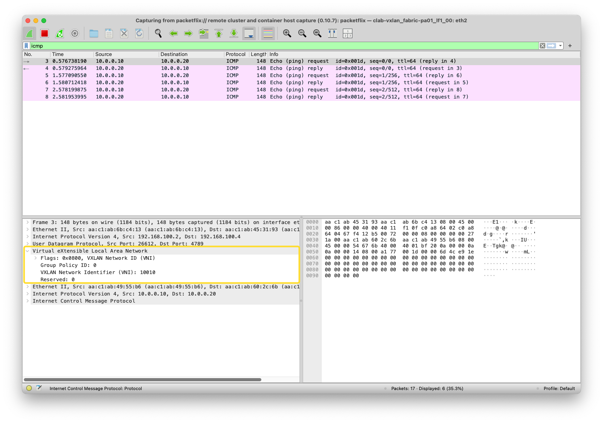

---
